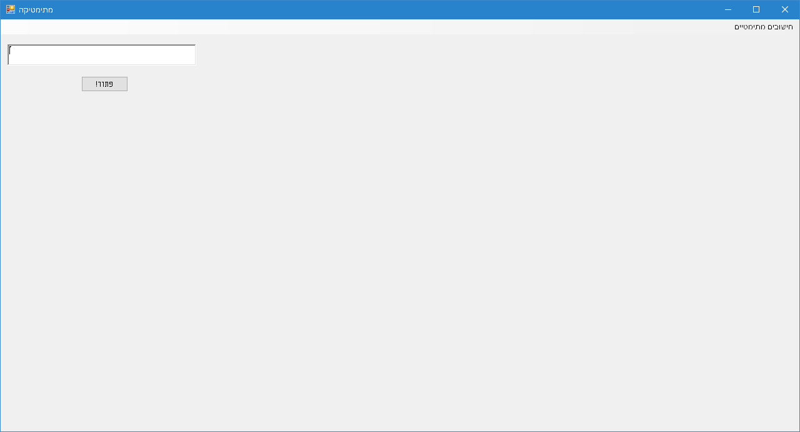
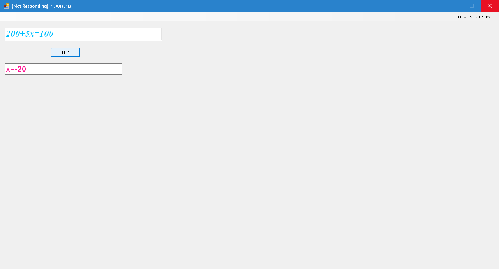

**MathSoft**

**Solves equations in one unknown**

Notice: all sound files (.wav files) MUST be located in Resources folder, which
should be located two levels above the running executable file:

The Main screen of the application looks like that:

Now, we open the main menu and select "Equation solving, one unknown":

(this is the only available & working option)

If speakers are turned ON, we'll hear a message: "Enter an equation in the text
field".

The text field will be displayed with a button "Solve!":

Now, we enter an equation in one unknown, which can contain plus or minus signs
inside (+ and/or -).

Pressing "Solve!" will:

-   read aloud our input;

-   read aloud the output (equation solution):

-   At the end of the read aloud process, our equation solution is displayed:

After the equation is solved, the text field is clear and we can continue
solving another equation.

The software also treats the following cases:

-   Equation with no solution (such as 0x=7)

-   Equation which every real number can solve (such as 5x-5x=0)

**Code location:**

<https://github.com/LiorBob/MathSoft/blob/master/MathSoft/frmMath.vb>

**YouTube demo:**

<https://www.youtube.com/watch?v=NqKyowR4S0E>
